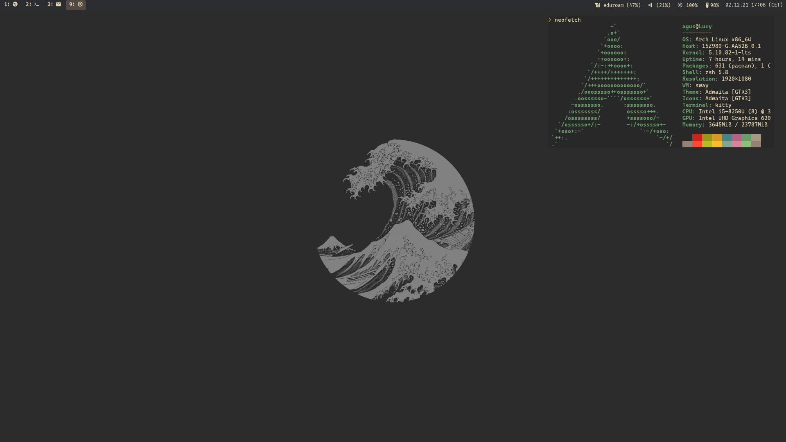

# Agus' dotfiles



## Software

* [GNU/Linux (Arch)](https://archlinux.org/)
* [NeoVim](https://neovim.io/)
* [Sway](https://swaywm.org/)
* [Swaylock](https://github.com/swaywm/swaylock)
* [Swayidle](https://github.com/swaywm/swayidle)
* [Waybar](https://github.com/Alexays/Waybar)
* [Wofi](https://cloudninja.pw/docs/wofi.html)
* [Mako](https://github.com/emersion/mako)
* [Kitty](https://sw.kovidgoyal.net/kitty/)
* [Glow](https://github.com/charmbracelet/glow)
* [Grim](https://github.com/emersion/grim)
* [Slurp](https://github.com/emersion/slurp)

## Installation

1. Install the required applications
2. Clone the repository
3. Execute ```bash download_wallpaper.sh``` to download the wallpaper
4. Copy repository content into ~/.config
